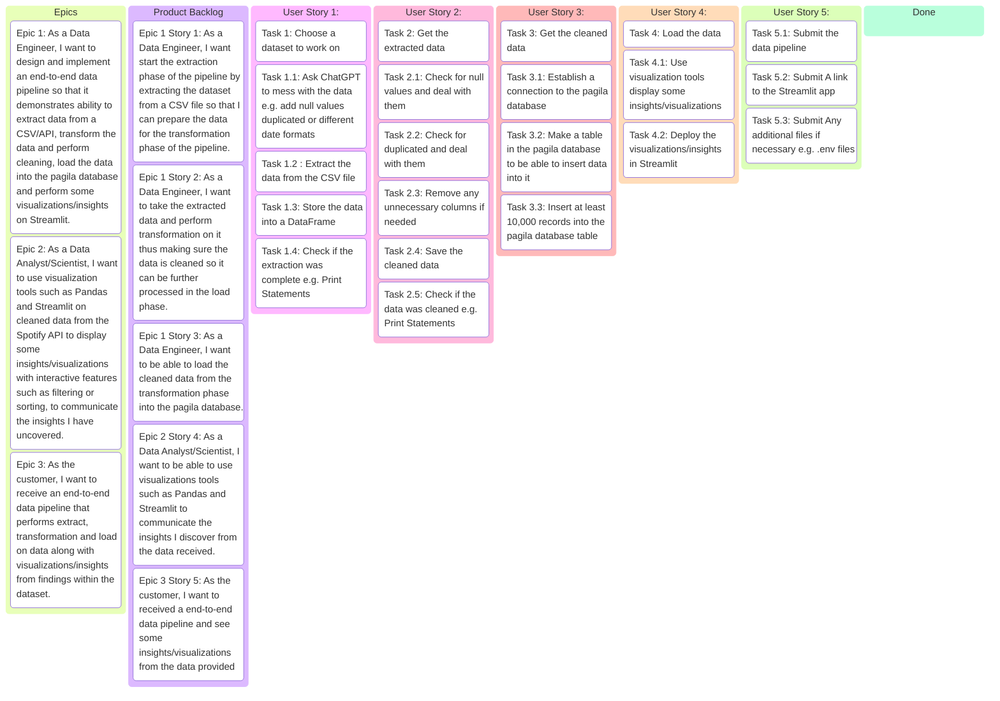

## Set up a local environment
```bash
#Make an environment
python3 -m venv .venv

# Activate the environment based on your device

# For Windows
source .venv/Scripts/activate

# For Mac
source .venv/bin/activate

# Install requirements
pip install -r requirements.txt
```
---
## Data for this Project

- Kaggle dataset by Rodolfo Figueroa:
  - https://www.kaggle.com/datasets/rodolfofigueroa/spotify-12m-songs?resource=download
- Spotify API:
  - https://developer.spotify.com/documentation/web-api/tutorials/getting-started

## Required files
```text
You need a .env.dev file
# Development Environment Variables

# Source Database Configuration
SOURCE_DB_NAME=<DB_NAME>
SOURCE_DB_USER=<DB_USER>
SOURCE_DB_PASSWORD=<DB_PASSWORD>
SOURCE_DB_HOST=<DB_HOST>
SOURCE_DB_PORT=<DB_PORT>

# Target Database Configuration
TARGET_DB_NAME=<DB_NAME>
TARGET_DB_USER=<DB_USER>
TARGET_DB_PASSWORD=<DB_PASSWORD>
TARGET_DB_HOST=<DB_HOST>
TARGET_DB_PORT=<DB_PORT>

# Spotify API Credentials
SPOTIFY_CLIENT_ID=<SPOTIFY_CLIENT_ID>
SPOTIFY_CLIENT_SECRET=<SPOTIFY_CLIENT_SECRET>
SPOTIFY_REDIRECT_URI=<SPOTIFY_REDIRECT_URI>
```
```text
You need a .env.test file
# Development Environment Variables

# Source Database Configuration
SOURCE_DB_NAME=<DB_NAME>
SOURCE_DB_USER=<DB_USER>
SOURCE_DB_PASSWORD=<DB_PASSWORD>
SOURCE_DB_HOST=<DB_HOST>
SOURCE_DB_PORT=<DB_PORT>

# Target Database Configuration
TARGET_DB_NAME=<DB_NAME>
TARGET_DB_USER=<DB_USER>
TARGET_DB_PASSWORD=<DB_PASSWORD>
TARGET_DB_HOST=<DB_HOST>
TARGET_DB_PORT=<DB_PORT>

# Spotify API Credentials
SPOTIFY_CLIENT_ID=<SPOTIFY_CLIENT_ID>
SPOTIFY_CLIENT_SECRET=<SPOTIFY_CLIENT_SECRET>
SPOTIFY_REDIRECT_URI=<SPOTIFY_REDIRECT_URI>
```
## How to get Spotify API Client ID,secret and redirect uri
- Login into the Spotify for developers and click on dashboard: https://developer.spotify.com/

- Create app

- Fill in the app name, app description redirect uris and make sure to tick the Web API!
```text
Redirect URIs : http://127.0.0.1:8888/callback
```

- Click on the app to view Client ID and click on "View client secret" to see the client secret


---
---

## Project Requirements as an Epic

```text
As the customer,
I want a robust pipeline that extracts, cleans, standardizes and loads data into the pagila database using CSV data along with some insights/visualizations using the Spotify API and Streamlit.
So that way I can showcase my foundational skills as a data engineer through the core stages of a data engineering workflow: extracting data from a real-world source, transforming it for analysis, loading it into a target system, and presenting actionable insights through interactive visualizations.
```

---
---

## EPIC 1

```text
As a Data Engineer,
I want to design and implement an end-to-end data pipeline so that it demonstrates ability to extract data from a CSV/API, transform the data and perform cleaning, load the data into the pagila database and perform some visualizations/insights on Streamlit.
```

---
---

## EPIC 2

```text
As a Data Analyst/Scientist,
I want to use visualization tools (such as Pandas and Streamlit) on cleaned data from the Spotify API to display some insights/visualizations with interactive features such as filtering or sorting, to communicate the insights I have uncovered.
```

---
---

## EPIC 3

```text
As the customer,
I want to receive an end-to-end data pipeline that performs extract, transformation and load on data along with visualizations/insights from findings within the dataset.
```

---
---

## EPIC 1 Breakdown

```text
As a Data Engineer,
I want to design and implement an end-to-end data pipeline so that it demonstrates ability to extract data from a CSV/API, transform the data and perform cleaning, load the data into the pagila database and perform some visualizations/insights on Streamlit.
```

---

### USER STORY 1

```text
As a Data Engineer,
I want start the extraction phase of the pipeline by extracting the dataset from a CSV file so that I can prepare the data for the transformation phase of the pipeline.
```

#### USER STORY 1 ACCEPTANCE CRITERIA

- [X] Have a chosen CSV file data to perform extraction
- [X] Extract the data from the CSV file
- [X] Store it into a DataFrame so it's ready for further processing
- [X] Check if the extraction was completed e.g. Print statements

---

### USER STORY 2

```text
As a Data Engineer,
I want to take the extracted data and perform transformation on it thus making sure the data is cleaned so it can be further processed in the load phase.
```

#### USER STORY 2 ACCEPTANCE CRITERIA

- [X] Get the extracted data
- [X] Check for check for null values and deal with them
- [X] Check for duplicated and deal with them
- [X] Remove any unnecessary columns if needed
- [X] Save the cleaned data
- [X] Check if the data was cleaned e.g. Print Statements

---

### USER STORY 3

```text
As a Data Engineer,
I want to be able to load the cleaned data from the transformation phase into the pagila database.
```

##### USER STORY 3 ACCEPTANCE CRITERIA

- [X] Get the cleaned data
- [X] Establish a connection to the pagila database
- [X] Check if the connection was successful
- [X] Make a table in the pagila database to be able to insert data into it
- [X] Insert at least 10,000 records into the pagila database table

---

## EPIC 2 Breakdown

```text
As a Data Analyst/Scientist,
I want to use visualization tools (such as Pandas and Streamlit) on cleaned data from the Spotify API to display some insights/visualizations with interactive features such as filtering or sorting, to communicate the insights I have uncovered.
```

### USER STORY 4

```text
As a Data Analyst/Scientist,
I want to be able to use visualizations tools such as Pandas and Streamlit to communicate the insights I discover from the data received. 
```

#### USER STORY 4 ACCEPTANCE CRITERIA
- [X] Load the data from the API
- [X] Use visualization tools display some insights/visualizations
- [X] Deploy the visualizations/insights in Streamlit 

---

## EPIC 3 Breakdown

```text
As the customer,
I want to receive an end-to-end data pipeline that performs extract, transformation and load on data along with visualizations/insights from findings within the dataset.
```

### USER STORY 5

```text
As the customer,
I want to received a end-to-end data pipeline and see some insights/visualizations from the data provided.
```

### USER STORY 5 ACCEPTANCE CRITERIA
- [X] Submit the data pipeline
- [X] Submit A link to the Streamlit app
- [X] Submit Any additional files if necessary e.g. .env files

---


## Definition Of Done

- [X] All Epics and User Stories completed
- [X] Everything submitted

---

## Project Kanban Board


## Key Insights
I use the Spotify API and take a look into a simple artists comparison, which compares artists based on popularity, an Artist album and Singles counter, Artist and User Insights based or user input

---


---

## Limitations/Issues
- GibHub blocks files larger than 100MB
  - Took me a while to figure out how to commit all my CSV to my origin/main in the end I used Git LFS to solve the issue
- Spotify API
- Authentication issues and not getting results (404 errors)
  - I couldn't "Get Several Browse Categories or "GetAlbum" which restricted how much I could show a lot of my data is artists based
  - For example I wanted to do Top 10 Global Songs for example but I couldn't retrieve the album
- Spotify API call has a result limit of 50 per request
  - Found a CSV on Kaggle with 1.2 million records which is essential made from the Spotify API as I needed at least 10,000 (see "Data for this Project") to perform my ETL process.
- Spotify API data is already cleaned
  - Had to ask ChatGPT to mess up my data so I can demonstrate ETL process.
- Simple Artist Comparison
  - Issues with the limitation: when I set the limit to 50 and receive the top 50 results because name isn't unique I can end up with an artists with the same name but not the artist I want but If i lower the limit I get a more accurate results

## What Would I do differently in the future
- Figure out a way to fix the authentications issues that I was getting that way I could show a variety of different insights and not just artists and user data
- More testing - I would of liked to written my own tests as opposed to using print statements to see if everything was working as intended
- Potentially Concatenate ids and name or name and followers to solve the issues of getting artists with the same one and selected the wrong artists
- Include AWS services - see if I can use some AWS services in my streamlit e.g. S3 to store large amounts of data like the CSVs

