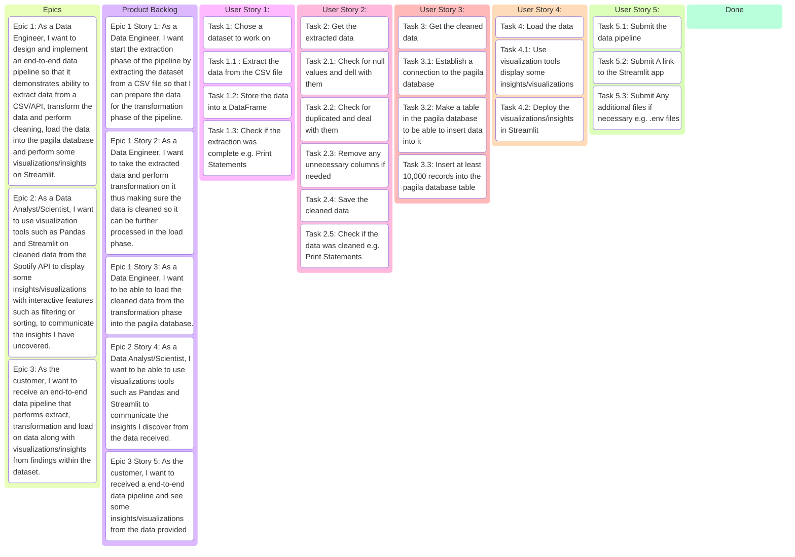

---
---

## Project Requirements as an Epic

```text
As the customer,
I want a robust pipeline that extracts, cleans, standardizes and loads data into the pagila database using CSV data along with some insights/visualizations using the Spotify API and Streamlit.
So that way I can showcase my foundational skills as a data engineer through the core stages of a data engineering workflow: extracting data from a real-world source, transforming it for analysis, loading it into a target system, and presenting actionable insights through interactive visualizations.
```

---
---

## EPIC 1

```text
As a Data Engineer,
I want to design and implement an end-to-end data pipeline so that it demonstrates ability to extract data from a CSV/API, transform the data and perform cleaning, load the data into the pagila database and perform some visualizations/insights on Streamlit.
```

---
---

## EPIC 2

```text
As a Data Analyst/Scientist,
I want to use visualization tools (such as Pandas and Streamlit) on cleaned data from the Spotify API to display some insights/visualizations with interactive features such as filtering or sorting, to communicate the insights I have uncovered.
```

---
---

## EPIC 3

```text
As the customer,
I want to receive an end-to-end data pipeline that performs extract, transformation and load on data along with visualizations/insights from findings within the dataset.
```

---
---

## EPIC 1 Breakdown

```text
As a Data Engineer,
I want to design and implement an end-to-end data pipeline so that it demonstrates ability to extract data from a CSV/API, transform the data and perform cleaning, load the data into the pagila database and perform some visualizations/insights on Streamlit.
```

---

### USER STORY 1

```text
As a Data Engineer,
I want start the extraction phase of the pipeline by extracting the dataset from a CSV file so that I can prepare the data for the transformation phase of the pipeline.
```

#### USER STORY 1 ACCEPTANCE CRITERIA

- [ ] Have a chosen CSV file data to perform extraction
- [ ] Extract the data from the CSV file
- [ ] Store it into a DataFrame so it's ready for further processing
- [ ] Check if the extraction was completed e.g. Print statements

---

### USER STORY 2

```text
As a Data Engineer,
I want to take the extracted data and perform transformation on it thus making sure the data is cleaned so it can be further processed in the load phase.
```

#### USER STORY 2 ACCEPTANCE CRITERIA

- [ ] Get the extracted data
- [ ] Check for check for null values and deal with them
- [ ] Check for duplicated and deal with them
- [ ] Remove any unnecessary columns if needed
- [ ] Save the cleaned data
- [ ] Check if the data was cleaned e.g. Print Statements

---

### USER STORY 3

```text
As a Data Engineer,
I want to be able to load the cleaned data from the transformation phase into the pagila database.
```

##### USER STORY 3 ACCEPTANCE CRITERIA

- [ ] Get the cleaned data
- [ ] Establish a connection to the pagila database
- [ ] Check if the connection was successful
- [ ] Make a table in the pagila database to be able to insert data into it
- [ ] Insert at least 10,000 records into the pagila database table

---

## EPIC 2 Breakdown

```text
As a Data Analyst/Scientist,
I want to use visualization tools (such as Pandas and Streamlit) on cleaned data from the Spotify API to display some insights/visualizations with interactive features such as filtering or sorting, to communicate the insights I have uncovered.
```

### USER STORY 4

```text
As a Data Analyst/Scientist,
I want to be able to use visualizations tools such as Pandas and Streamlit to communicate the insights I discover from the data received. 
```

#### USER STORY 4 ACCEPTANCE CRITERIA
- [ ] Load the data
- [ ] Use visualization tools display some insights/visualizations
- [ ] Deploy the visualizations/insights in Streamlit 

---

## EPIC 3 Breakdown

```text
As the customer,
I want to receive an end-to-end data pipeline that performs extract, transformation and load on data along with visualizations/insights from findings within the dataset.
```

### USER STORY 5

```text
As the customer,
I want to received a end-to-end data pipeline and see some insights/visualizations from the data provided.
```

### USER STORY 5 ACCEPTANCE CRITERIA
- [ ] Submit the data pipeline
- [ ] Submit A link to the Streamlit app
- [ ] Submit Any additional files if necessary e.g. .env files

---


## Definition Of Done

- [ ] All Epics and User Stories completed
- [ ] Code is linted and follows style guidelines
- [ ] Everything submitted

---

## Project Kanban Board



